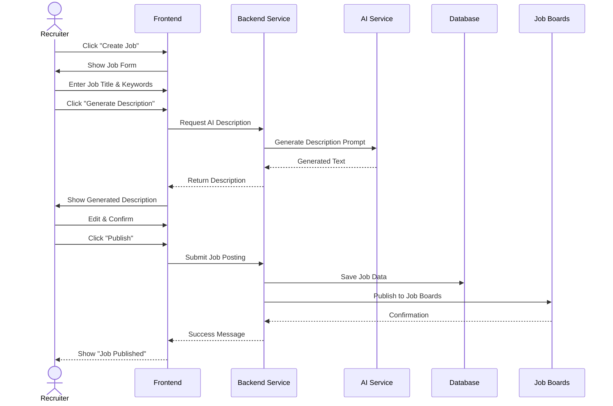
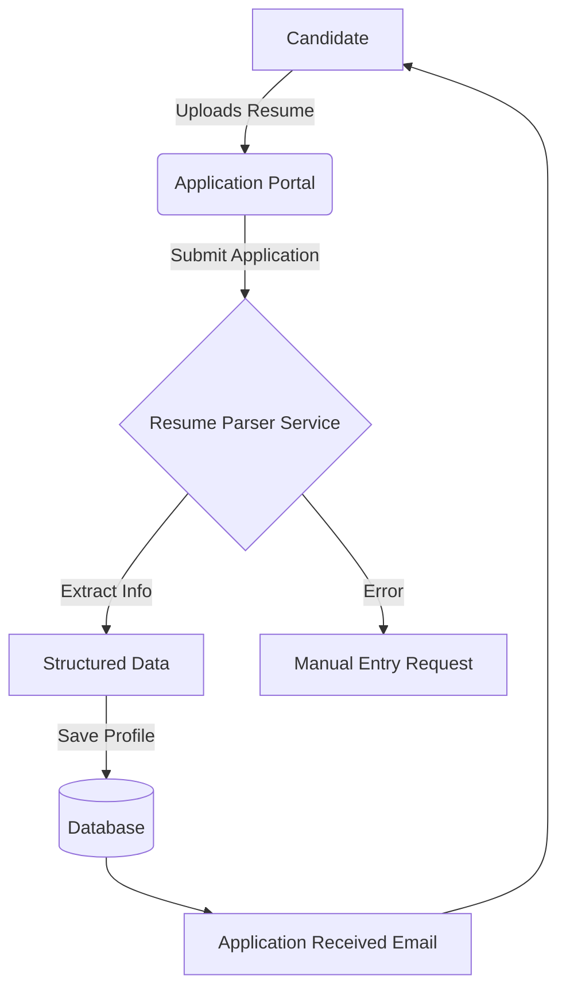
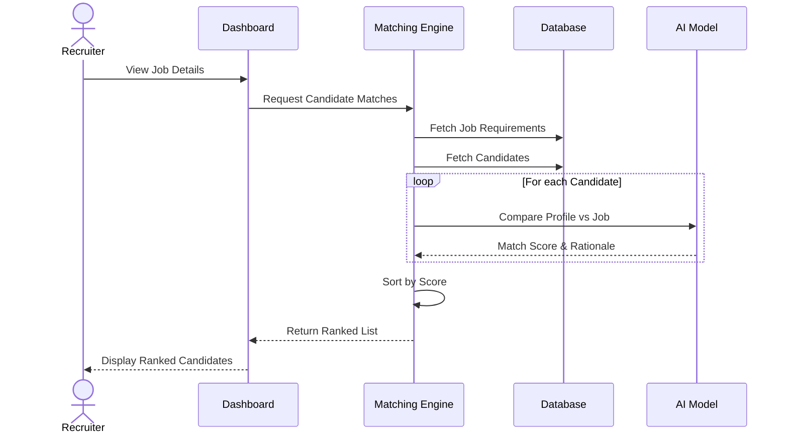
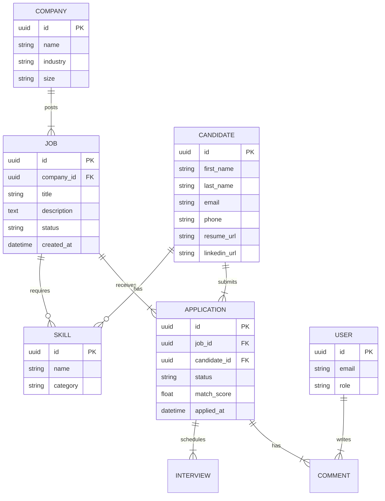
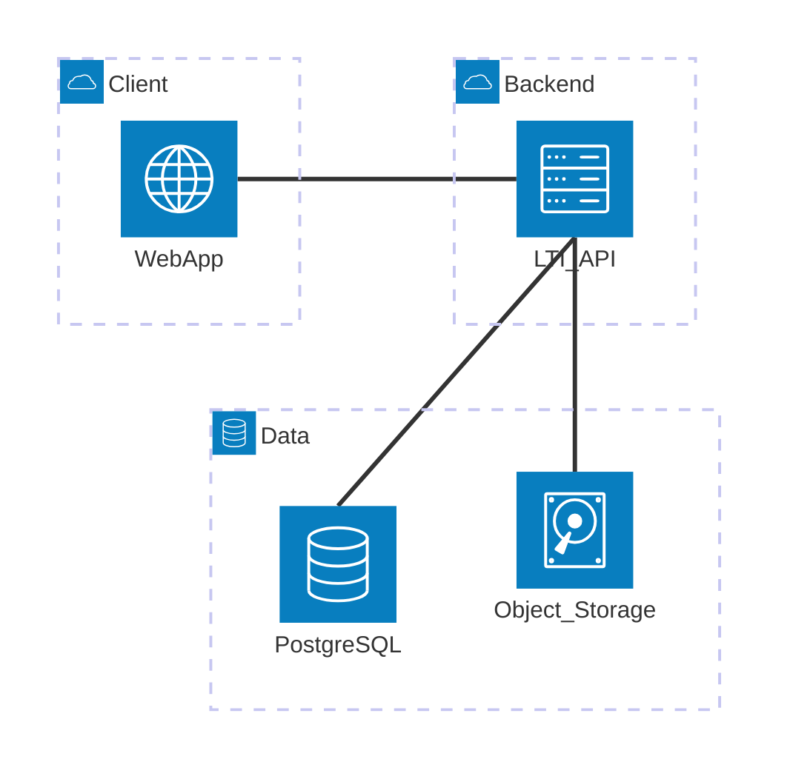
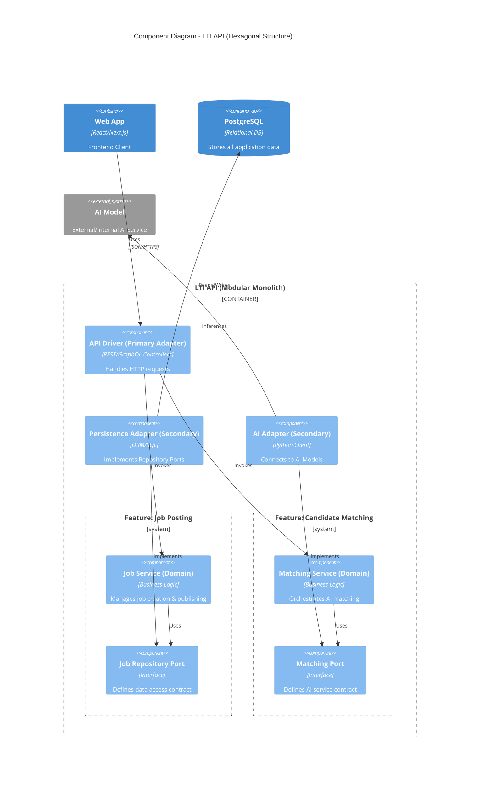

# LTI - Applicant Tracking System (ATS)

## 1. Description & Value Proposition

### Brief Description
LTI is a next-generation Applicant Tracking System (ATS) designed to revolutionize the recruitment process. It leverages advanced AI and automation to streamline workflows, enhance collaboration between recruiters and hiring managers, and significantly reduce time-to-hire while improving the quality of hires.

### Value Added & Competitive Advantages
-   **AI-Driven Efficiency**: Automates repetitive tasks like resume screening, scheduling, and candidate communication, allowing HR teams to focus on strategic decision-making.
-   **Real-Time Collaboration**: A unified platform where recruiters and managers can collaborate seamlessly, share feedback instantly, and make data-driven hiring decisions together.
-   **Smart Matching Engine**: Utilizes AI to match candidates to job descriptions with high accuracy, reducing the time spent on manual screening.
-   **User-Centric Design**: A modern, intuitive interface that requires minimal training and provides a superior user experience for both recruiters and candidates.

### Main Features
1.  **Smart Job Posting**: Create and distribute job openings across multiple channels with AI-assisted description writing.
2.  **Candidate Matching Engine**: Automatically ranks candidates based on skills, experience, and cultural fit using AI algorithms.
3.  **Collaborative Hiring Portal**: A shared workspace for recruiters and managers to review profiles, leave comments, and rate candidates in real-time.
4.  **Automated Workflows**: Custom triggers for email notifications, interview scheduling, and status updates.
5.  **Analytics Dashboard**: Real-time insights into the hiring pipeline, time-to-hire, and source effectiveness.

## 2. Lean Canvas

### Mermaid Diagram

```mermaid
block-beta
  columns 5
  block:Problem
    P1["Inefficient HR workflows"]
    P2["Poor collaboration"]
    P3["Manual screening"]
  end
  block:Solution
    S1["AI Automation"]
    S2["Real-time Portal"]
    S3["Smart Matching"]
  end
  block:Value
    V1["Reduce time-to-hire"]
    V2["Improve hire quality"]
    V3["Seamless collaboration"]
  end
  block:Advantage
    A1["AI-first approach"]
    A2["Superior UX"]
  end
  block:Customer
    C1["HR Departments"]
    C2["Recruitment Agencies"]
    C3["Hiring Managers"]
  end

  P1 --> S1
  P2 --> S2
  P3 --> S3

  S1 --> V1
  S2 --> V3
  S3 --> V2
```

### Lean Canvas Table

| Section | Description |
| :--- | :--- |
| **Problem** | 1. Inefficient manual workflows in HR departments. 2. Lack of real-time collaboration between recruiters and hiring managers. 3. Time-consuming manual candidate screening. |
| **Solution** | 1. AI-driven automation for repetitive tasks. 2. A unified collaborative portal for real-time feedback. 3. Smart Candidate Matching Engine. |
| **Unique Value Proposition** | The ATS that empowers HR teams to hire faster and better through AI automation and seamless collaboration, turning recruitment into a strategic advantage. |
| **Unfair Advantage** | Proprietary AI matching algorithms and a "collaboration-first" design philosophy that competitors lack. |
| **Customer Segments** | 1. Mid-to-large sized companies with internal HR departments. 2. Recruitment agencies looking for efficiency. 3. Fast-growing startups needing scalable hiring solutions. |
| **Key Metrics** | 1. Time-to-Hire. 2. Cost-per-Hire. 3. Candidate Satisfaction Score (NPS). 4. Recruiter/Manager Collaboration Index. |
| **Channels** | 1. Direct Sales (B2B). 2. Digital Marketing (LinkedIn, SEO). 3. Partnerships with HR consultancies. |
| **Cost Structure** | 1. Software Development & Maintenance. 2. AI Model Training & Hosting. 3. Sales & Marketing expenses. 4. Customer Support. |
| **Revenue Streams** | 1. SaaS Subscription (Monthly/Yearly per user). 2. Enterprise Licensing. 3. Premium AI Features Add-on. |

## 3. Functional Design (Use Cases)

### Use Case 1: Job Posting Creation
**Actor**: Recruiter / Hiring Manager
**Description**: The user creates a new job posting, utilizing AI to generate the job description, and publishes it to multiple job boards.

### Use Case 2: Candidate Application & Parsing
**Actor**: Candidate
**Description**: A candidate applies for a job, and the system automatically parses their resume to extract structured data.

### Use Case 3: AI Candidate Matching
**Actor**: Recruiter
**Description**: The system automatically ranks candidates for a specific job based on the match between their profile and the job requirements.

## 4. Technical Design

### 4.1 Data Model

The data model is designed to support the core tracking and matching capabilities of the ATS.

### 4.2 High-Level System Design

The system follows a **Modular Monolith** architecture with a clear separation between the Frontend (Web App) and the Backend (API). The Backend is structured using **Hexagonal Architecture** and **Vertical Slicing** to ensure maintainability and scalability.

**Components:**
1.  **Web App (SPA)**: React/Next.js application serving as the single frontend for all user roles (Recruiters, Managers, Candidates).
2.  **API Gateway / Load Balancer**: Entry point for SSL termination and routing.
3.  **LTI API (Modular Monolith)**: The core application containing all business logic, organized by features (Vertical Slices).
4.  **Database**: PostgreSQL for relational data.
5.  **Object Storage**: S3 for resumes and documents.
6.  **External Services**: Integrations with Job Boards, Email Providers, etc.

### 4.3 C4 Component Diagram: LTI API (Hexagonal Architecture)

This diagram illustrates the internal structure of the **LTI API**, following **Hexagonal Architecture (Ports & Adapters)** and **Vertical Slicing**. The application is divided into feature modules (Slices), each containing its own domain logic, ports, and adapters.

**Key Concepts:**
-   **Vertical Slicing**: Code is organized by feature (e.g., `JobPosting`, `CandidateMatching`) rather than technical layer.
-   **Screaming Architecture**: Folder/Component names clearly indicate what the system *does*.
-   **Hexagonal**: Domain logic is isolated from external concerns (Database, API, AI Services) via Ports and Adapters.

